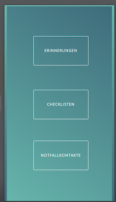
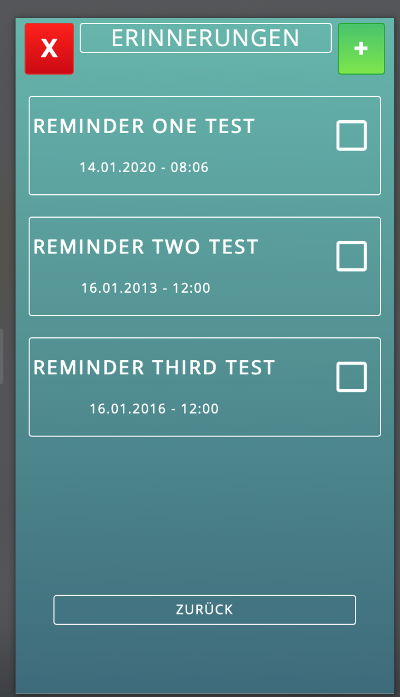

## ChecklistenReminder

### Idee

##### Problemstellung

Alzheimer-Patienten haben das Problem, dass sie wichtige Sachen vergessen. Vor allem wenn es darum geht z.B. von Zuhause entfernt zu sein kommt es oft zu Unsicherheiten.

##### Lösungsansatz

Wir haben uns überlegt, dass eine Anwendung die nicht nur Reminder anbietet, sondern auch eine Art Gedächtnisstütze - in Form von persistenten Checklisten - dabei helfen kann wenn solche Unsicherheiten aufkommen.

Diese Checklisten sollen automatisch Orts- oder Zeit- (Reminder) gebunden angezeigt werden.  

Ziel dieser App ist es, vorgefertigte Checklisten zu speichern und diese dann mit Remindern zu verknüpfen. Dies soll es Demenzerkrankten oder Beteiligten ermöglichen, oft wiederholte Tätigkeiten im Voraus zu speichern und bei bestimmten Aktivitäten aufzurufen. 
Beispielsweise die Routine des Verlassens des Hauses.

* **Küchengeräte abstellen**
* **Fenster schließen**
* **Schlüssel einpacken**
* **Geldbeutel mitnehmen**

  **...**
	
Ein Reminder für den Arztbesuch:
* **Versichertenkarte mitnehmen**
* **Überweisungsschein mitnehmen**

	
Diese Checkliste kann nun mit beliebig vielen Erinnerungen verknüpft werden und wird angezeigt, wenn die Erinnerung eintritt.

### Getting Started

Auf der folgenden Website erhalten Sie eine Kopie des Projekts : https://gitlab.lrz.de/swe1ws20192020/g5

### Vorraussetzungen
	Als Benutzer:
	Ein Endgerät mit Browser
	
	Als Entwickler:
	AngularCLI

    Node.js 8.9 oder höher: https://nodejs.org

    Visual Studio Code: https://code.visualstudio.com
        Angular-Schule: Extension Pack für Visual Studio Code
        Bei Bedarf kann auch eine andere IDE verwendet werden, z.B. IntelliJ.
    
	Git (und ggf. ein grafischer Client wie SourceTree oder GitExtensions)

### Installation

Diese Anwendung läuft noch nicht über einen Webserver. 
Im Browser wird localhost:4200/ aufgerufen.

## Built With

* [AngularCLI](https://cli.angular.io/) - The web framework used

## FAQ

* Wieviel kostet die Anwendung? 

  Nichts.
  
* Wie wird man von der Anwendung benachrichtigt?

  Die Anwendung soll Sie auf verschiedene Arten über ihr Smartphone visuell, akustisch oder haptisch benachrichtigen können.
## Authors

* ** Viet Phuoc Ho**
* ** Fabian Diener**
* ** Johannes Jaeger**
* ** Leonard Maier**
